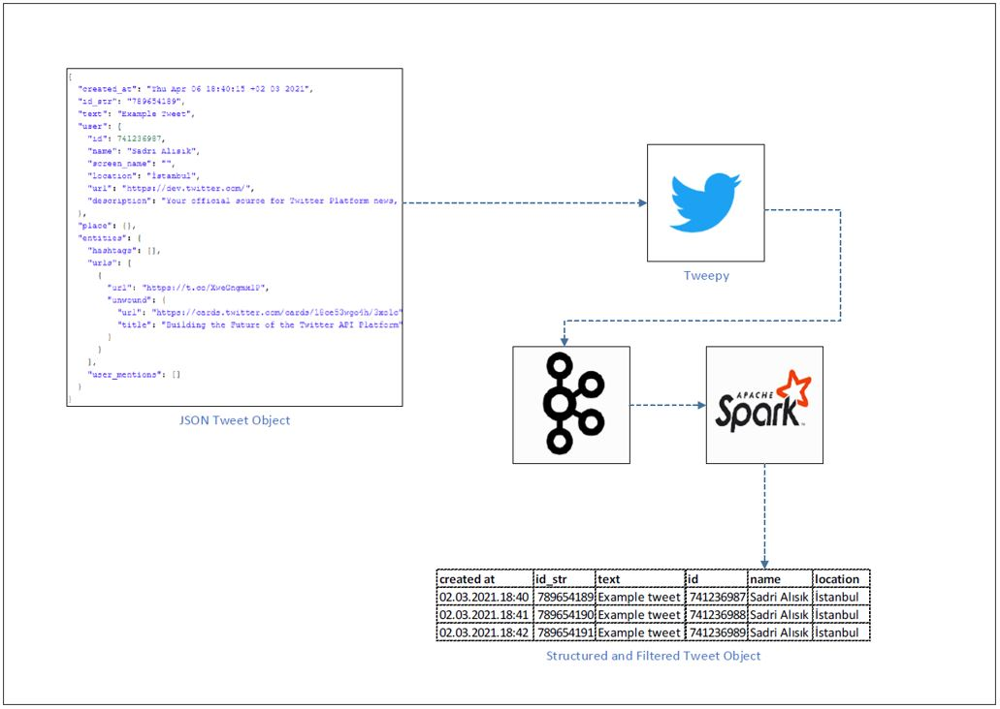

# Spark_Kafka_Stream_Twitter
### Dataflow Pipeline


### Task List

- [x] Create twitter developer account
- [x] Install pykafka (pykafka==2.8.0)
- [x] Install tweepy (tweepy==3.10.0)
- [x] Set account configurations on twitter_config.py

```
consumer_key = 'TWITTER_APP_CONSUMER_KEY'
consumer_secret = 'TWITTER_APP_CONSUMER_SECRET'
access_token = 'TWITTER_APP_ACCESS_TOKEN'
access_secret = 'TWITTER_APP_ACCESS_SECRET'
```

- [x] Create kafka push class inherited from StreamListener
```
class KafkaPushListener(StreamListener):
	def __init__(self):
		#localhost:9092 = Default Zookeeper Producer Host and Port Adresses
		self.client = pykafka.KafkaClient("localhost:9092")

		#Get Producer that has topic name is Twitter
		self.producer = self.client.topics[bytes("twitter", "ascii")].get_producer()

	def on_data(self, data):
		#Producer produces data for consumer
		#Data comes from Twitter
		self.producer.produce(bytes(data, "ascii"))
		return True

	def on_error(self, status):
		print(status)
		return True
```

- [x] Set #hashtag which you want to track
```
twitter_stream.filter(track=['#EnesUguroglu'])
```
- [x] Create spark session
```
    spark = SparkSession \
        .builder \
        .appName("PythonStreamingKafkaTweetCount") \
        .master("local[3]") \
        .config("spark.streaming.stopGracefullyOnShutdown", "true") \
        .getOrCreate()
 ```
- [x] Create schema for desired informations
```
    #Preparing schema for tweets
    schema = StructType([
        StructField("created_at", StringType()),
        StructField("id_str",IntegerType()),
    	StructField("text", StringType()),
        StructField("user", StructType([
            StructField("id",IntegerType()),
            StructField("name",StringType()),
            StructField("location",StringType())
        ])),
    ])
 ```
- [x] Read stream from kafka topic
```
    #Read from kafka topic named "twitter"
    kafka_df = spark.readStream \
        .format("kafka") \
        .option("kafka.bootstrap.servers", "localhost:9092") \
        .option("subscribe", "twitter") \
        .option("startingOffsets", "earliest") \
        .load()
```
- [x] Deserialize json value from string (Because we read from Kafka)
```
value_df = kafka_df.select(from_json(col("value").cast("string"),schema).alias("value"))
```
- [x] Create structure using Spark DataFrame functions
```
    explode_df = value_df.selectExpr("value.created_at", "value.id_str", "value.text",
                                     "value.user.id", "value.user.name", "value.user.location")

    #explode_df.printSchema()
    #Converting created_at column to timestamp
    final_df = explode_df \
        .withColumn("created_at", to_timestamp(col("created_at"), "yyyy-MM-dd HH:mm:ss"))
```
- [x] Write stream to the console
```
    console_query = final_df.writeStream \
    .format("console") \
    .outputMode("append") \
    .option("checkpointLocation", "chk-point-dir") \
    .trigger(processingTime="1 minute") \
    .start()

    console_query.awaitTermination()
 ```
- [ ] Write stream to the cassandra

### Code Description

To implement this project yourself you need to apply twitter developer account first. You can use [link](https://developer.twitter.com/en/apply-for-access) to submit an application. Then you can follow steps mentioned on the task list above.

kafka_tweet_producer.py is used to connect Twitter API with the Apache Kafka as well as filtering streams accourding to given hashtag.

twitter_structured_stream_spark_kafka_console.py  is used to create sparksession to read from Kafka topic and make necessary transformations on the data. Finally we are printing outputs to the console

### Running

1. Start zookeeper (Check kafka scripts)
```
zookeeper-server-start.bat config\zookeeper.properties (zookeeper-server-start.sh for linux)
 ```
2. Start kafka (Check kafka scripts)
```
kafka-server-start.bat config\server.properties  (kafka-server-start.sh for linux)
 ```
3. Execute below code first
```
spark-submit kafka_tweet_producer.py
```
4. Finally execute below code
```
spark-submit --packages org.apache.spark:spark-sql-kafka-0-10_2.12:3.0.1 twitter_structured_stream_spark_kafka_console.py
```
Note that we added spark kafka integration package taken from maven respository, if you already added this one into your spark conf you can skip that part.


